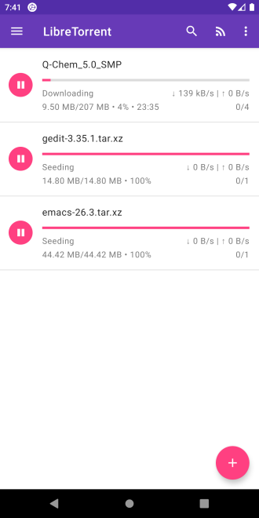
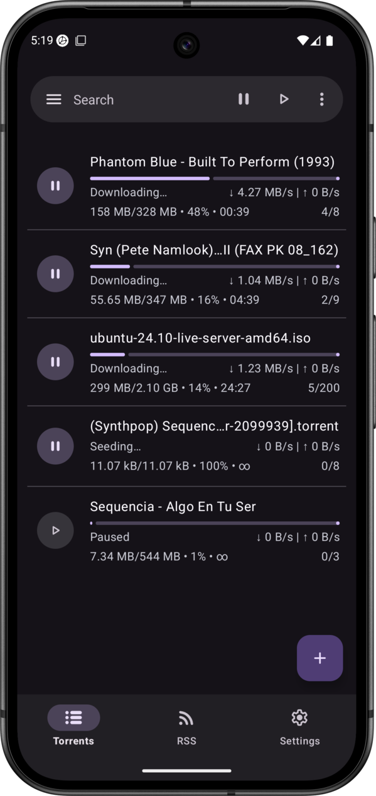
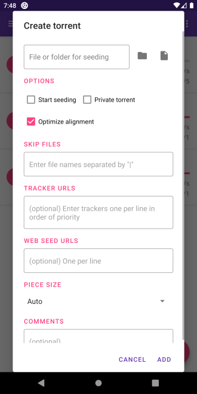
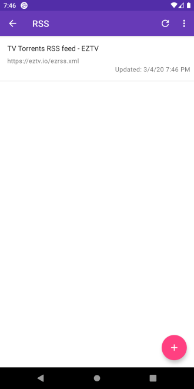
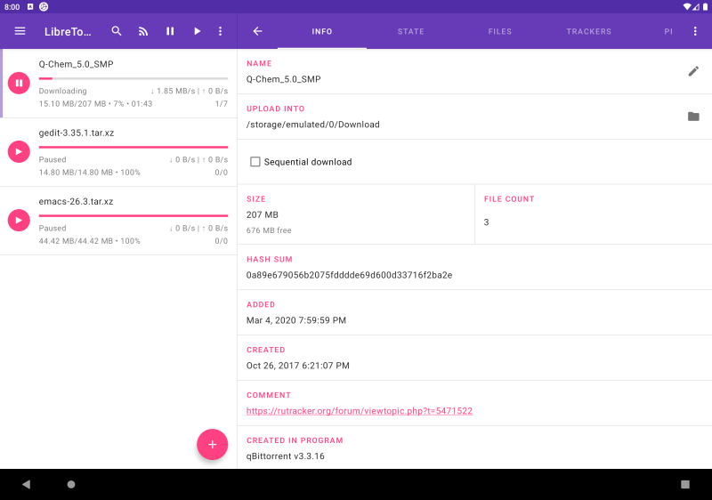

<h2><b>LibreTorrent</b></h2>
<h4>Copylefted libre full-featured torrent client for Android.</h4>

**Issues**: https://gitlab.com/proninyaroslav/libretorrent/issues

[Use, see, change and share](https://en.wikipedia.org/wiki/Free_software); [with all](https://en.wikipedia.org/wiki/Copyleft).

---

## Screenshots

## 📋 Features

**[Note for Android 12+]**: Google Play version doesn't have permission to access all files, use another version (F-Droid or direct APK).

* BitTorrent 2.0 and WebTorrent support
* Select which files to download
* Move files while downloading
* Auto-move downloaded files to another folder or external drive
* Stream files, with sequential downloads
* Android TV
* Material design, dark and black theme, and tablet UI
* Customisable network, battery, and UI settings, etc.
* 35+ translations
* Scheduling
* Auto-downloading, with Atom/RSS manager
* Create torrents, with many and big files
* HTTP\S and magnet links
* DHT, PeX, encryption, LSD, UPnP, NAT*PMP, µTP
* IP filtering (eMule dat and PeerGuardian)
* Supports proxy for trackers and peers
* Based on [libtorrent4j](https://github.com/aldenml/libtorrent4j)
* And more

## 🌍 Translations

Help translate the app at [Hosted Weblate](https://hosted.weblate.org/engage/libretorrent/)

## 💰 Donations

The development is 100% funded by heroic people like you. If you have problems with payment or you want to donate in another way, contact me at `proninyaroslav@mail.ru`. Thank you!

 - **Bitcoin**: `12isaLkH8nZ4DkFguVFeYrGHqQi7EEgUrM `
 - **USDT TRC20**: `TK79fzUYwRtmANuLjk1Zzhz3hjTaFQbxfg`
 - **Monero**: `48j4Mo7J7t51EeBf35Lpdmehmi9chUwzSXxHrnjpRJ6fPQafPWvSCdFafw3rA5ZRWievfYEDToNso8VppbJf2RVH9cdZmHa`
 - **YooMoney (ЮMoney)**: `410011738561939`
 - **Patreon**: [patreon.com/YaroslavPronin](https://patreon.com/YaroslavPronin)
 - **Boosty**: [boosty.to/yaroslavpronin/donate](https://boosty.to/yaroslavpronin/donate)
 - **Amazon.com eGift Cards**: just choose your amount and type e-mail `proninyaroslav@mail.ru`
in the gift card details [smile.amazon.com/gp/product/B004LLIKVU](https://smile.amazon.com/gp/product/B004LLIKVU)
 - **Liberapay**: 

## 🎉 Contributors

Please see [CONTRIBUTING.md](CONTRIBUTING.md)

#### Developers

* [Yaroslav Pronin](https://gitlab.com/proninyaroslav)

## 🔒 Privacy Policy

Please see our [Privacy Policy](PRIVACY.md).

## 📄 License

    Copyright (C) 2016 Yaroslav Pronin <proninyaroslav@mail.ru>
    This file is part of LibreTorrent.
    LibreTorrent is free software: you can redistribute it and/or modify
    it under the terms of the GNU General Public License as published by
    the Free Software Foundation, either version 3 of the License, or
    (at your option) any later version.
    This program is distributed in the hope that it will be useful,
    but WITHOUT ANY WARRANTY; without even the implied warranty of
    MERCHANTABILITY or FITNESS FOR A PARTICULAR PURPOSE.  See the
    GNU General Public License for more details.
    You should have received a copy of the GNU General Public License
    along with this program.  If not, see <http://www.gnu.org/licenses/>.
